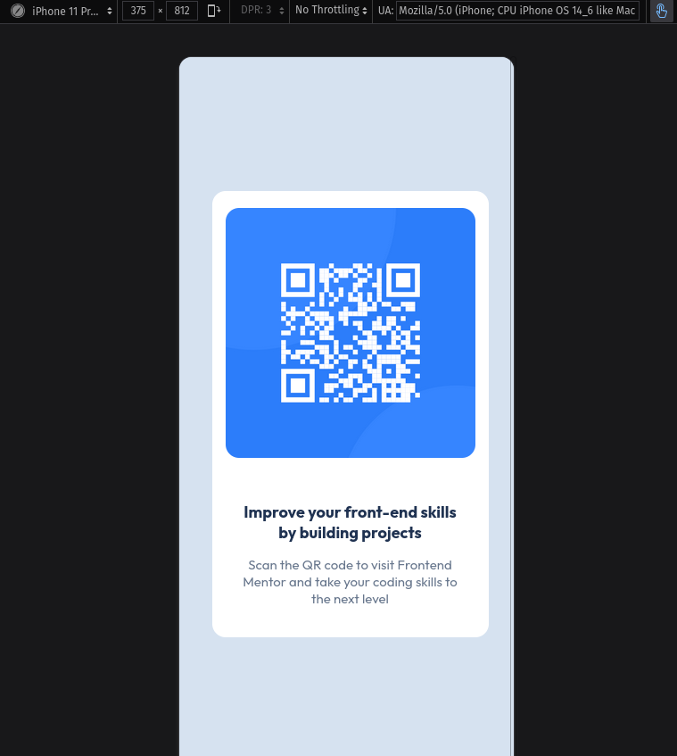
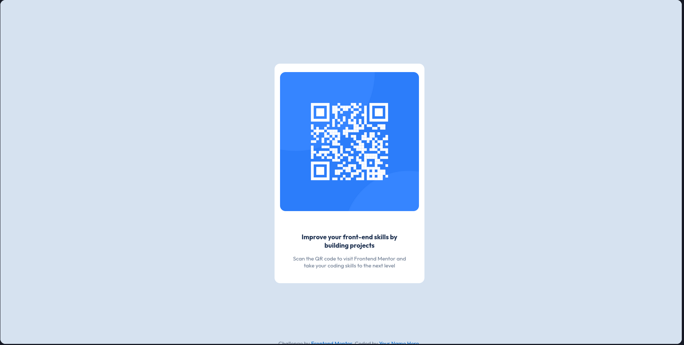

# Frontend Mentor - QR code component solution

This is a solution to the [QR code component challenge on Frontend Mentor](https://www.frontendmentor.io/challenges/qr-code-component-iux_sIO_H). Frontend Mentor challenges help you improve your coding skills by building realistic projects.

## Table of contents

- [Screenshot](#screenshot)
- [Author](#author)

## Screenshot

### Mobile Design

### Desktop Design

## Author

- Frontend Mentor - [@vengeance-mak](https://www.frontendmentor.io/profile/vengeance-mak)
